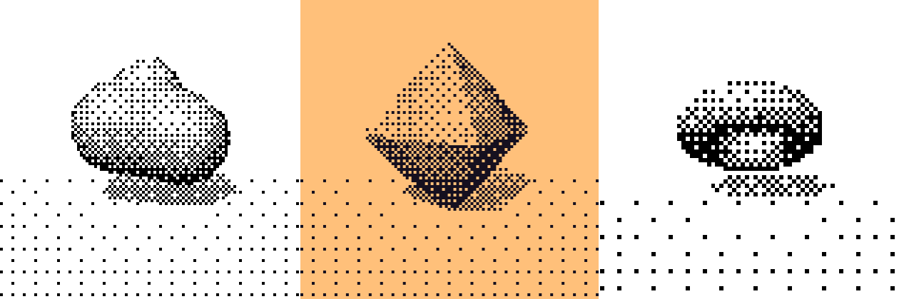

# Dither Light · Bayer 有序抖动

一个**仓库即 Skill** 的抖动特效项目：既是 Claude Code 等 AI agent 可直接调用的 Skill，也是一个零依赖的 Web Component 和一个打开即玩的小玩具。核心算法是 **Bayer 有序抖动**——可以把本地图片变成复古网点画，也可以给网页加上漂移的抖动光影背景。



## 三种用法

### ① 作为 Skill 用（推荐给 Claude Code 用户）

把仓库克隆到 skills 目录：

```bash
git clone https://github.com/jhuanxx44/dithering-tool.git ~/.claude/skills/dither-light
```

然后在 Claude Code 里直接说人话，agent 会读取 `SKILL.md` 并调用本仓库的能力：

- 「帮我把这张照片做成抖动网点风格」→ agent 搭好本地图片处理器给你用
- 「给我的网页项目加一个抖动光影背景」→ agent 把组件集成进你的项目

### ② 直接玩

```bash
open index.html        # 或 python3 -m http.server 8000 后访问
```

游乐场里可以实时调所有参数，也能拖入本地图片做抖动处理、下载 PNG（纯本地，不上传）。

### ③ 作为前端组件集成到自己的项目

`dither-light.js` 就是组件本体——单文件、零依赖，拷走即用；也可以通过 jsDelivr 引用：

```html
<script src="https://cdn.jsdelivr.net/gh/jhuanxx44/dithering-tool@main/dither-light.js"></script>
```

当背景特效用：

```html
<dither-light preset="shadow" light="auto" speed="1"
              style="position: fixed; inset: 0; z-index: -1;"></dither-light>
```

当图片处理器用：

```html
<dither-light src="photo.jpg" preset="duotone" matrix="8" grid="5"
              style="width: 100%; aspect-ratio: 4 / 3;"></dither-light>
```

组件尺寸完全由你的 CSS 控制（默认 `display: block`，需给定高度），内部自动适配尺寸变化与高 DPI。更多可复制粘贴的完整页面见 [`examples/`](examples/)（背景特效、独立图片处理器）。

## 组件文档

### 属性

所有属性都可随时用 `setAttribute` 修改，实时生效：

| 属性 | 取值 | 默认值 | 说明 |
| --- | --- | --- | --- |
| `preset` | `shadow` / `highlight` / `duotone` | `shadow` | 预设：白底黑点 / 黑底白点 / 双色调（渐变模式下对应 multiply / screen / overlay 混合模式） |
| `matrix` | `2` / `3` / `4` / `8` | `8` | Bayer 矩阵阶数，越高网点越细腻 |
| `grid` | `2` – `14` | `5` | 网点边长（px），越小越细腻、计算量越大 |
| `contrast` | `0.2` – `3` | `1.35` | 明暗过渡的对比强度 |
| `ambient` | `0` – `0.7` | `0.22` | 全局提亮程度 |
| `light` | `auto` / `pointer` | `auto` | 光源：自动游走或跟随指针（指针作用域为组件自身；图片模式下无效） |
| `speed` | `0` – `3` | `1` | 光源与渐变动画速度（图片模式下无效；用户系统开启「减少动态」时强制为 0） |
| `src` | 图片 URL | — | 设置后进入图片模式；跨域图片如需导出 PNG，请加 `crossorigin="anonymous"` 且服务端需允许 CORS |

### JS API

```js
const fx = document.querySelector('dither-light');

await fx.setImage(fileOrBlob);   // 传入 File / Blob / URL / HTMLImageElement，进入图片模式
fx.clearImage();                 // 清除图片，恢复渐变光影模式
fx.downloadPNG();                // 导出当前画面（默认文件名 dithered-原图名.png）
fx.hasImage;                     // 当前是否处于图片模式
```

### 事件

事件均 `bubbles` 且 `composed`，可穿透 Shadow DOM 在外层监听：

| 事件 | 时机 | `event.detail` |
| --- | --- | --- |
| `dither-load` | 图片加载完成 | `{ name, width, height }` |
| `dither-clear` | 图片已清除 | `{}` |
| `dither-error` | 图片加载失败 | `{ message }` |

### 在框架中使用

Web Component 是浏览器原生标准，无需任何适配层：

- **Vue / Angular / Svelte**：模板里直接写 `<dither-light>`，属性正常绑定
- **React 19+**：原生支持自定义元素的 props 与事件
- **React 18 及以下**：通过 `ref` 设置属性与监听事件（`el.setAttribute(...)`、`el.addEventListener(...)`）

## 仓库结构

```
├── SKILL.md             Skill 定义（agent 的入口：何时用、怎么用）
├── dither-light.js      核心组件，唯一需要分发的文件
├── index.html           游乐场演示页（基于组件实现）
├── examples/
│   ├── background.html        背景特效最小示例
│   └── image-processor.html   独立图片处理器（选图 → 调参 → 下载 PNG）
└── preview.png
```

## 游乐场参数说明

| 参数 | 说明 | 默认值 | 范围 |
| --- | --- | --- | --- |
| Preset | 预设：阴影 / 高光 / 双色调（multiply / screen / overlay） | Shadow | 3 种 |
| 光源 | 自动游走，或跟随指针（指针处亮、对侧暗） | 自动游走 | 2 种 |
| Bayer 矩阵 | 抖动矩阵阶数，阶数越高网点分布越细腻 | 8×8 | 2 / 3 / 4 / 8 |
| 速度 | 光源与渐变动画的速度倍数 | 1.00 | 0 – 3 |
| 网点 | 单个网点边长（px），越小越细腻、计算量越大 | 5 px | 2 – 14 px |
| 对比度 | 明暗过渡的对比强度 | 1.35 | 0.2 – 3 |
| 环境光 | 全局提亮程度，数值越大暗部越亮 | 0.22 | 0 – 0.7 |
| 本地图片 | 选择图片或把图片拖入页面即进入图片模式：图片亮度取代光场作为抖动输入，预设在图片模式下映射为白底黑点 / 黑底白点 / 双色调（深紫 + 暖橙）；加载后「光源」「速度」自动禁用，参数面板在指针离开时自动折叠为小圆钮（悬停 / 点击展开），可一键下载 PNG 或清除恢复渐变模式 | 未加载 | — |

## 实现原理

- **组件**：`dither-light.js` 注册 `<dither-light>` 自定义元素，Shadow DOM 内含渐变底层与抖动画布，样式与宿主页面完全隔离。
- **底层**：多层 `radial-gradient`（暖橙 / 粉红 / 紫）与深色 `linear-gradient`，用 CSS 动画缓慢漂移、缩放。
- **顶层**：canvas 按网格逐格计算光照值（或图片亮度），与 Bayer 阈值矩阵比较，决定该网点着黑 / 着白 / 透明。
- **混合**：渐变模式下通过 `mix-blend-mode`（`multiply` / `screen` / `overlay`）把抖动图层与渐变底层合成；图片模式下输出不透明结果。
- **性能**：每帧在低分辨率离屏 canvas 上逐格计算，再关闭平滑拉伸到全屏；图片模式按脏标记重绘，静态画面零开销。

## 浏览器支持

现代浏览器即可（依赖 Custom Elements、Shadow DOM、Canvas 2D、ResizeObserver、`mix-blend-mode`）。不需要网络、不需要任何安装。

## 许可证

[MIT](LICENSE)
